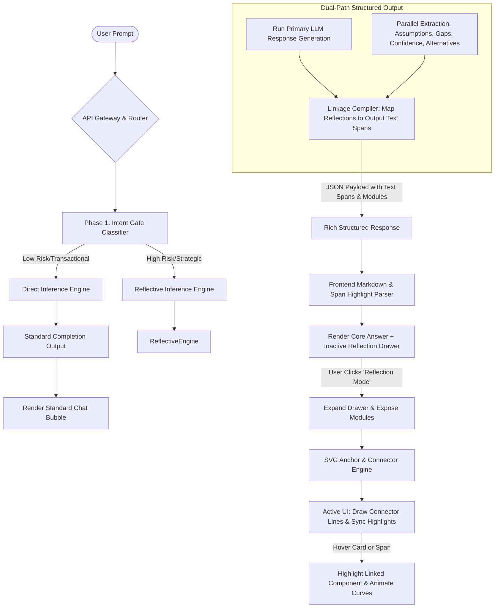

# Smart Reflection Layer: Phase-wise Implementation Architecture

This architecture document outlines the complete engineering design and phase-wise roadmap for implementing the **Smart Reflection Layer**, an intent-gated evaluation workspace designed to break the dangerous "skimming and rechecking" loop that causes cognitive fatigue for researchers.

The system remains completely hidden during routine tasks and triggers only when high-stakes, strategic reasoning is detected. Once active, it maps the AI's internal assumptions, data gaps, uncertainty boundaries, alternative perspectives, and a critical reflection prompt back to specific segments of the generated response using dynamic visual connectors, exactly as depicted in the interface mockups.

---

## 1. System Topology & Flow

The following diagram illustrates the end-to-end data flow, from the initial user prompt through the backend classification and inference engines to the frontend rendering pipeline.



---

## 2. Core Architectural Components

### 2.1 Backend: The Intent-Gated Pipeline

The backend must decide within milliseconds whether to route the prompt through the standard cheap path or the expensive reflection path.

```
       ┌──────────────────────────┐
       │       User Prompt        │
       └─────────────┬────────────┘
                     │
         [Is strategic/synthesis?]
                     ▼
          ┌────────────────────┐
     No   │  Intent Classifier ├──────────┐ Yes
   ┌──────┴────────────────────┘          │
   ▼                                      ▼
┌──────────────────────┐        ┌───────────────────┐
│ Low-Stakes Path      │        │ High-Stakes Path  │
│ - Standard LLM call  │        │ - Structured LLM  │
│ - Zero extra latency │        │ - Parallel reflection│
└──────────────────────┘        └───────────────────┘
```

#### A. Intent Classifier Layer
To minimize latency overhead, the **Intent Classifier** uses a hybrid architecture:
1. **Rule-Based Pre-Filter**: Instant regular expression and keyword checks for low-stakes operational requests (e.g., *"format..."*, *"regex..."*, *"convert..."*, *"translate..."*).
2. **Fast-Inference Vector Classification**: Compares prompt embeddings against an offline-indexed vector database of "strategic research tasks" vs "operational commands".
3. **Fallback LLM Classification**: A highly optimized, small 8B parameter model running at high concurrency, instructed to return a binary decision (`{ "is_strategic": true/false }`).

#### B. Reflective Inference Engine (Structured Generation)
When a prompt is flagged as high-stakes, the orchestrator triggers a dual-task generation. To guarantee that the reflection points exactly correspond to the generated text, we use **LLM Structured Outputs** (such as JSON schema validation) in a single-pass inference or a closely coupled parallel generation. 

```json
{
  "response_text": "Yes—prioritizing PLG growth is the right strategic bet for your B2B SaaS product... PLG will help you expand top-of-funnel volume, shorten time to value, and convert users... But establishing a PLG core now gives you optionality, compounding data advantages, and a defensible moat.",
  "reflection_mode": {
    "status": "active",
    "highlights": [
      {
        "id": "hl-1",
        "text_span": "shorten time to value",
        "category": "assumption"
      },
      {
        "id": "hl-2",
        "text_span": "defensible moat",
        "category": "alternative"
      }
    ],
    "modules": {
      "assumptions": [
        {
          "summary": "Assumes churn is feature-driven",
          "details": "Underlying premise presumes churn can be reduced purely through product improvements rather than contract terms or price sensitivity."
        },
        {
          "summary": "Assumes onboarding can scale efficiently",
          "details": "Assumes the self-serve funnel can handle high volume without human customer success intervention."
        }
      ],
      "missing_context": [
        {
          "summary": "No competitor pricing data",
          "details": "Pricing elasticity has not been provided, which heavily impacts user self-serve conversion."
        },
        {
          "summary": "Limited retention cohort evidence",
          "details": "Long-term cohort metrics were omitted, making PLG projections highly speculative."
        }
      ],
      "uncertainty_boundary": [
        {
          "summary": "Confidence decreases in enterprise-heavy markets",
          "details": "For products targeting high-ACV enterprise accounts, the model's PLG confidence is downgraded in favor of high-touch sales cycles."
        }
      ],
      "alternative_perspectives": [
        {
          "summary": "Sales-led growth may outperform PLG for high-ACV customers",
          "details": "A high-touch outbound motion frequently yields larger contract values and more stable retention in B2B enterprise segments."
        }
      ],
      "reflection_prompt": {
        "question": "What evidence would invalidate this recommendation in your market?"
      }
    }
  }
}
```

---

### 2.2 Frontend: The Interactive Evaluation Workspace

The user interface requires premium, pixel-perfect execution of interactive transitions and connectors.

```
+-------------------------------------------------------------+
| Claude                                                  [B] |
+-------------------------------------------------------------+
|  User: Should I prioritize PLG growth for our B2B SaaS?     |
|                                                             |
|  Yes-prioritizing PLG growth is the right strategic bet...  |
|  Your product has strong self-serve potential... PLG will   |
|  help you expand, [shorten time to value], and convert...   |
|  Establishing a PLG core now gives you a [defensible moat]. |
|                                                             |
|  [Reflection Mode Active]                           [^]     |
|  +-------------------------------------------------------+  |
|  | 1. Assumptions Detected                               |  |
|  | 2. Missing Context                                    |  |
|  | 3. Uncertainty Boundary                               |  |
|  | 4. Alternative Perspective                            |  |
|  | 5. Reflection Prompt                                  |  |
|  +-------------------------------------------------------+  |
+-------------------------------------------------------------+
```

#### A. Markdown Segment Highlighting
The markdown rendering engine dynamically wraps matching `text_span` strings in customized HTML nodes:
```html
<span 
  class="reflection-highlight highlight-orange" 
  data-reflection-id="hl-1"
>
  shorten time to value
</span>
```
These spans have elegant CSS styles applied:
- Border-bottom or background glow using soft orange gradients (`hsla(24, 100%, 50%, 0.15)`).
- Custom hover transition effects.

#### B. Dynamic SVG Connector Line Engine
To draw curved anchor lines connecting the highlights to the Reflection drawer (exactly like the orange lines in the screenshot):
1. **DOM Anchor Calculation**: An overlay `<svg class="connector-overlay-svg">` is placed behind or absolute-positioned over the chat window.
2. **Dynamic Coordinate Tracking**: A React hook uses `ResizeObserver` and scroll listeners to monitor the exact bounding box (`getBoundingClientRect()`) of:
   - The specific text span (e.g., `hl-1`).
   - The target attachment point on the Reflection Mode card wrapper.
3. **SVG Path Generation**: Custom Bezier curve math computes the `d` attribute of the SVG `<path>` dynamically:
   $$\text{Curve} = M(x_1, y_1) \quad C(x_1 + dx, y_1, x_2 - dx, y_2, x_2, y_2)$$
4. **Interactive Synced Highlights**:
   - Hovering over a card in the reflection module lights up the corresponding SVG path (increasing opacity and thickness) and triggers a gentle background glow on the target text span.
   - Hovering over a highlighted text span does the reverse: it illuminates the matching reflection card below.

---

## 3. Phase-wise Implementation Architecture

```
┌────────────────────────────────────────────────────────┐
│                      ROADMAP                           │
├────────────────────────────────────────────────────────┤
│ Phase 1: Engine & API Layer    ████████ 100%           │
│ Phase 2: Frontend Foundations  ░░██████ 60%            │
│ Phase 3: Visual Connector SVG  ░░░░████ 40%            │
│ Phase 4: UX Polish & Latency   ░░░░░░██ 20%            │
└────────────────────────────────────────────────────────┘
```

The rollout is divided into four highly focused, sequential phases to transition from raw LLM output to a highly immersive, interactive human-in-the-loop validation workspace.

### Phase 1: LLM Engine, System Prompting & API Contracts (Week 1–2)
**Goal:** Create a reliable backend pipeline that correctly classifies strategic intent and reliably generates structured reflection outputs.

*   **Task 1.1: Strategic Intent Classifier Implementation**
    *   Build a dual-path routing middleware.
    *   Implement keyword filters and lightweight classification models using local small LLMs (e.g., Llama 3 8B-Instruct) or fine-tuned text embedding classifiers.
*   **Task 1.2: System Prompt Engineering for Parallel Self-Reflection**
    *   Develop a system prompt instructing the model to generate responses while simultaneously compiling its internal assumptions, gaps, and boundaries.
    *   Inject schema-enforcing constraints (e.g., JSON schema / Pydantic models) to ensure structured outputs always align with the direct answer.
*   **Task 1.3: API Design & Payload Contracting**
    *   Establish REST/gRPC endpoints delivering unified response payloads.
    *   Ensure exact string offsets or token indices are included in the JSON payload to allow deterministic string matching on the frontend.
*   **Task 1.4: Unit Tests & Evaluation Harness**
    *   Establish a "Golden Dataset" of strategic queries (e.g., competitive analysis, product decisions) and operational queries (e.g., code formatting).
    *   Run automated evaluation scripts to verify zero false positives/negatives in routing, and 95%+ JSON structure validity.

---

### Phase 2: Frontend Layout & Reflection Component Assembly (Week 3)
**Goal:** Implement the UI framework, markdown rendering engine, and standard cards for the five Reflection modules.

*   **Task 2.1: Glassmorphic Component UI Layout**
    *   Design the mobile/desktop container for the chat thread and response bubble.
    *   Apply a premium styling system: muted warm colors, clean typography (e.g., Inter, Outfit), and beautiful card states.
*   **Task 2.2: Expandable Reflection Mode Drawer**
    *   Create the "Reflection Mode Available — Reasoning Inspection Layer" toggle bar.
    *   Implement fluid CSS transitions using `grid-template-rows: 0fr -> 1fr` or Framer Motion to expand the card smoothly downward when clicked.
*   **Task 2.3: Reflection Modules Implementation**
    *   Build the 5 expandable accordion modules (Assumptions, Missing Context, Uncertainty Boundary, Alternative Perspectives, Reflection Prompt) with their distinct colors, custom SVGs (document, question mark, bar chart, diverging paths, lightbulb), and pill badges.
*   **Task 2.4: Text Parser and Span Wrapper**
    *   Create a specialized text rendering pipeline. After receiving markdown, run a post-processor that locates designated `text_spans` in the generated answer and wraps them in semantic `<span>` tags styled with custom underlines.

---

### Phase 3: Interactive Visual Linkage & SVG Connector Engine (Week 4)
**Goal:** Develop the mathematical SVG path-drawing library and wire up high-fidelity hover and focus synchronization between the text and the drawer.

*   **Task 3.1: Canvas/SVG Overlay Integration**
    *   Place a global, responsive SVG viewport container behind the chat UI thread.
    *   Write a custom React hook / Vue directive to observe the positions of text highlights and reflection card targets dynamically.
*   **Task 3.2: Bezier Path Math & Drawing Engine**
    *   Write an algorithm to compute anchor coordinate paths.
    *   Implement horizontal brackets (`]`) and smooth cubic Bezier lines connecting the brackets to target points on the cards, mirroring the visual flow in the mockup.
*   **Task 3.3: Resize & Scroll Handling**
    *   Implement debounce/throttle mechanisms that recompute and redraw SVG connector lines on window resize, scroll, or device rotation to prevent lines from detaching from their elements.
*   **Task 3.4: Synced Interactive States**
    *   Bind hover listeners to both the inline text spans and the reflection cards.
    *   On hover:
        *   Trigger scale adjustments on the corresponding connector line.
        *   Increase line stroke opacity from `0.2` to `0.85` with smooth transition animations (`cubic-bezier(0.16, 1, 0.3, 1)`).
        *   Glow the matching card and text span.

---

### Phase 4: UX Polish, Streaming Performance & Latency Mitigation (Week 5–6)
**Goal:** Optimize system performance to ensure reflection layers do not degrade the core user experience.

*   **Task 4.1: Streamed-Response Chunk Parser**
    *   Support chunked HTTP streaming (Server-Sent Events).
    *   Render the main conversational text chunk-by-chunk in real-time.
    *   Hold the "Reflection Mode" data inside the final chunks, fading it into the bottom container once text generation completes.
*   **Task 4.2: Parallel Backend Execution & Caching**
    *   Utilize pre-computation/caching on the backend. When a strategic prompt is detected, generate the core answer and execute reflection models in parallel threads rather than sequentially.
    *   Cache common query sub-graphs or general topic assumptions to achieve sub-second execution.
*   **Task 4.3: High-Fidelity Micro-Animations**
    *   Refine all micro-interactions: card expand chevrons, highlight glows, custom hover tooltips, and spring-based animations.
*   **Task 4.4: Accessibility & Responsive Layouts**
    *   Implement full keyboard navigation (focusing on links and cards).
    *   Design clean fallback behaviors for ultra-small mobile displays, such as hiding connector lines and utilizing floating indicator bubbles instead to avoid layout clutter.

---

## 4. Key Engineering Challenges & Mitigations

> [!WARNING]
> **1. Latency Overhead of Dual-Generation**
> *   *Challenge:* Running a strategic classifier and dual inference pathways can double LLM response time, severely frustrating users.
> *   *Mitigation:* Stream the primary response immediately to the user. The UI displays the main response in real-time, while the Reflection Layer is computed in parallel. By the time the user finishes reading the response, the reflection drawer completes loading and smoothly fades into view at the bottom, achieving zero perceived latency overhead.

> [!IMPORTANT]
> **2. Alignment Drift during Layout Changes**
> *   *Challenge:* SVG lines can quickly become misaligned or lag behind text elements when users scroll, resize windows, or dynamic images load.
> *   *Mitigation:* Use standard CSS absolute positioning relative to a parent container for local components, and couple it with `ResizeObserver` bound directly to the chat bubble. To avoid performance drops during scroll events, translate lines via high-performance GPU-accelerated CSS `transform` operations rather than re-rendering the SVG paths at 60fps.

> [!CAUTION]
> **3. Over-Filtering / Under-Filtering in Intent Classification**
> *   *Challenge:* Showing the reflection layer for simple tasks (like *"convert 5 miles to km"*) creates visual noise, while failing to show it for strategic tasks defeats the system's core value.
> *   *Mitigation:* Establish strict classification criteria. Strategic tasks must satisfy at least one of these conditions:
>     *   Contains multivariable tradeoffs (e.g., PLG vs Sales).
>     *   Requires forecasting/projections under uncertainty.
>     *   Requires synthesizing research from multiple theoretical domains.
>     Run weekly regression tests against the golden validation set to fine-tune classifier precision.

---

## 5. Summary Matrix: Phase Rollout Timeline

| Phase | Duration | Key Deliverables | Risk Level | Target Metrics |
| :--- | :--- | :--- | :--- | :--- |
| **Phase 1** | 2 Weeks | API contract, intent router, structured schema generator, prompt engine | Medium | Classifier F1-Score > 0.92, Schema validation rate 99.8% |
| **Phase 2** | 1 Week | Responsive UI thread, Glassmorphic reflection card set, Markdown span wrapper | Low | Component load time < 80ms, 100% browser rendering parity |
| **Phase 3** | 1 Week | SVG overlay canvas, dynamic Bezier paths, resize observer hook, synced hovers | High | Render sync lag < 16ms (60 FPS), zero line-detachment bugs |
| **Phase 4** | 2 Weeks | Streamed chunk parser, parallel execution pipeline, micro-animations, mobile fallback | Medium | Perceived reflection latency = 0ms, Web Vitals LCP < 1.2s |
